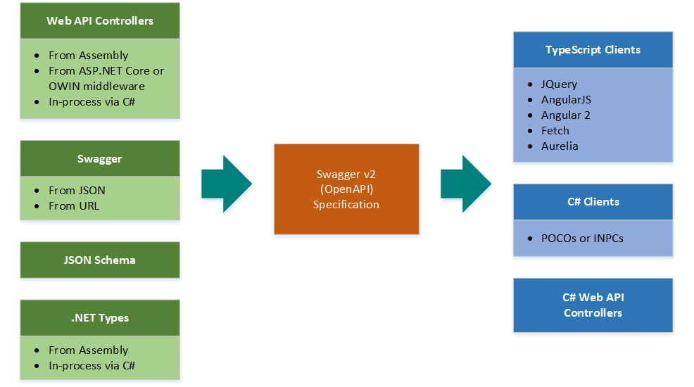
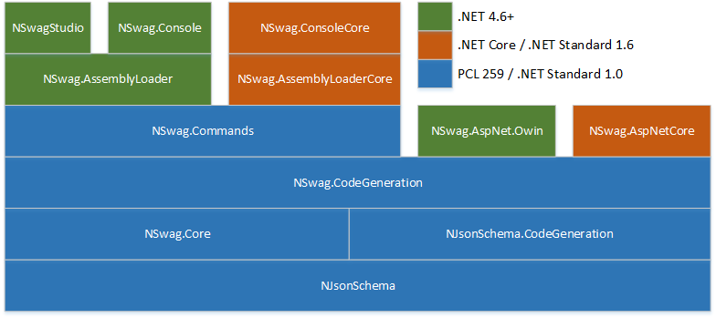

## NSwag: The Swagger/OpenAPI toolchain for .NET, Web API and TypeScript

[](https://www.nuget.org/packages?q=NSwag)
[](https://www.npmjs.com/package/nswag)
[](https://ci.appveyor.com/project/rsuter/nswag)
[](https://ci.appveyor.com/project/rsuter/nswag-25x6o)
[](https://www.myget.org/gallery/nswag-ci)
[](https://gitter.im/NSwag/NSwag)
[](http://stackoverflow.com/questions/tagged/nswag)
[](https://github.com/rsuter/nswag/wiki)

NSwag is a Swagger/OpenAPI 2.0 (3.0 in the works) toolchain for .NET, .NET Core, Web API, ASP.NET Core, TypeScript (jQuery, AngularJS, Angular 2+, Aurelia, KnockoutJS, and more) and other platforms, written in C#. The [Swagger specification](http://swagger.io) uses JSON and JSON Schema to describe a RESTful web API. The NSwag project provides tools to generate Swagger specifications from existing ASP.NET Web API controllers and client code from these Swagger specifications. 

The project combines the functionality of Swashbuckle (Swagger generation) and AutoRest (client generation) in one toolchain. This way a lot of incompatibilites can be avoided and features which are not well described by the Swagger specification or JSON Schema are better supported (e.g. [inheritance](https://github.com/NJsonSchema/NJsonSchema/wiki/Inheritance), [enum](https://github.com/NJsonSchema/NJsonSchema/wiki/Enums) and reference handling). The NSwag project heavily uses [NJsonSchema for .NET](http://njsonschema.org) for JSON Schema handling and C#/TypeScript class/interface generation. 



The project is developed and maintained by [Rico Suter](http://rsuter.com) and other contributors. 

**Ways to use the toolchain:** 

- Simple to use Windows GUI, [NSwagStudio](https://github.com/NSwag/NSwag/wiki/NSwagStudio)
- Via [command line](https://github.com/NSwag/NSwag/wiki/CommandLine) (Windows, Mac and Linux support through [Mono](http://www.mono-project.com/) or .NET Core console binary, also via [NPM package](https://www.npmjs.com/package/nswag))
- By using the [Swagger or Swagger UI OWIN and ASP.NET Core Middlewares](https://github.com/NSwag/NSwag/wiki/Middlewares) (also serves the [Swagger UI](http://swagger.io/swagger-ui)) (recommended)
- In your C# code, via [NuGet](https://www.nuget.org/packages?q=NSwag)
- In your [MSBuild targets](https://github.com/NSwag/NSwag/wiki/MSBuild)
- In your [Cake](https://cakebuild.net) scripts using [Cake.NSwag](https://agc93.github.io/Cake.NSwag/doc/intro.html) (external community project, may not use latest NSwag version)

**Tutorials**

- [Video Tutorial: How to integrate NSwag into your ASP.NET Core Web API project (5 mins)](https://www.youtube.com/watch?v=lF9ZZ8p2Ciw)
- [Integrate the NSwag toolchain into your ASP.NET Web API project](https://blog.rsuter.com/nswag-tutorial-integrate-the-nswag-toolchain-into-your-asp-net-web-api-project/)
- [Generate an Angular TypeScript client from an existing ASP.NET Web API web assembly](https://blog.rsuter.com/nswag-tutorial-generate-an-angular-2-typescript-client-from-an-existing-asp-net-web-api-web-assembly/)

**Swagger Generators:**

- ASP.NET Web API assembly to Swagger (supports .NET Core)
    - [AspNetCoreToSwaggerGenerator](https://github.com/RSuter/NSwag/wiki/AspNetCoreToSwaggerGenerator)
    - [WebApiToSwaggerGenerator](https://github.com/NSwag/NSwag/wiki/WebApiToSwaggerGenerator)
        - Generates a Swagger specification for Web API controllers
    - [WebApiAssemblyToSwaggerGenerator](https://github.com/NSwag/NSwag/wiki/WebApiAssemblyToSwaggerGenerator)
        - Generates a Swagger specification for controllers in an external Web API assembly
        - [Also supports loading of .NET Core assemblies](https://github.com/RSuter/NSwag/wiki/Assembly-loading)
    - [AssemblyTypeToSwaggerGenerator](https://github.com/NSwag/NSwag/wiki/AssemblyTypeToSwaggerGenerator)
         - Generates a Swagger specification containing only types from .NET assemblies

**Code Generators:** 

- **CSharp Client**
	- [SwaggerToCSharpClientGenerator](https://github.com/NSwag/NSwag/wiki/SwaggerToCSharpClientGenerator)
		- Generates C# clients from a Swagger specification
		- Generates POCOs or classes implementing [INotifyPropertyChanged](https://msdn.microsoft.com/en-us/library/system.componentmodel.inotifypropertychanged(v=vs.110).aspx) supporting DTOs
		- The generated clients can be used with full .NET, .NET Core, Xamarin and .NET Standard 1.4 in general
- **CSharp Controllers** (contract first/schema first development)
	- [SwaggerToCSharpControllerGenerator](https://github.com/NSwag/NSwag/wiki/SwaggerToCSharpControllerGenerator)
	    - Generates Web API Controllers based on a Swagger specification (ASP.NET Web API and ASP.NET Core)
- **TypeScript Client**
	- [SwaggerToTypeScriptClientGenerator](https://github.com/NSwag/NSwag/wiki/SwaggerToTypeScriptClientGenerator)
		- Generates TypeScript clients from a Swagger specification
		- Available templates/supported libraries: 
			- JQuery with Callbacks, `JQueryCallbacks`
			- JQuery with promises `JQueryPromises`
			- AngularJS using $http, `AngularJS`
			- Angular (v2+) using the http service, `Angular`
			- window.fetch API and ES6 promises, `Fetch` (use this template in your React/Redux app)
			- Aurelia using the HttpClient from aurelia-fetch-client, `Aurelia` (based on the Fetch template)
	    
**Downloads**

- [Download latest **NSwagStudio MSI installer**](http://rsuter.com/Projects/NSwagStudio/installer.php) (Windows Desktop application)
- [Download latest **NSwag command line tools** and NSwagStudio as ZIP archive](http://rsuter.com/Projects/NSwagStudio/archive.php)
- [Download latest **CI Build Artifacts** from AppVeyor](https://ci.appveyor.com/project/rsuter/nswag/build/artifacts) (command line tools and NSwagStudio binaries)

**NPM Packages**

- [NSwag](https://www.npmjs.com/package/nswag): Command line tools (.NET and .NET Core) distributed as NPM package

**NuGet Packages**

Specification:

- **[NSwag.Core](https://www.nuget.org/packages/NSwag.Core/)** (.NET Standard 1.0 and .NET 4.5): 
    - The Swagger reader and writer classes, see [SwaggerDocument](https://github.com/RSuter/NSwag/wiki/SwaggerDocument)
- **[NSwag.Core.Yaml](https://www.nuget.org/packages/NSwag.Core.Yaml/)** (.NET Standard 1.3 and .NET 4.5): 
    - Extensions to read and write YAML Swagger specifications
- **[NSwag.Annotations](https://www.nuget.org/packages/NSwag.Annotations/)** (.NET Standard 1.0 and .NET 4.5): 
    - Attributes to decorate Web API controllers to control the Swagger generation

Swagger generation:

- **[NSwag.SwaggerGeneration](https://www.nuget.org/packages/NSwag.SwaggerGeneration/)** (.NET Standard 1.0 and .NET 4.5): 
    - Classes to generate Swagger specifications
- **[NSwag.SwaggerGeneration.WebApi](https://www.nuget.org/packages/NSwag.SwaggerGeneration.WebApi/)** (.NET Standard 1.0 and .NET 4.5): 
    - Classes to generate Swagger specifications from Web API controllers, see [WebApiToSwaggerGenerator](https://github.com/RSuter/NSwag/wiki/WebApiToSwaggerGenerator)
- **[NSwag.SwaggerGeneration.AspNetCore](https://www.nuget.org/packages/NSwag.SwaggerGeneration.AspNetCore/)** (.NET Standard 1.6 and .NET 4.5.1): 
    - (Experimental) Classes to generate Swagger specifications from ASP.NET Core MVC controllers using the ApiExplorer

Code generation:

- **[NSwag.CodeGeneration](https://www.nuget.org/packages/NSwag.CodeGeneration/)** (.NET Standard 1.3 / .NET 4.5.1): 
    - Base classes to generate clients from Swagger specifications
- **[NSwag.CodeGeneration.CSharp](https://www.nuget.org/packages/NSwag.CodeGeneration.CSharp/)** (.NET Standard 1.3 and .NET 4.5.1): 
    - Classes to generate C# clients from Swagger specifications, see [SwaggerToCSharpClientGenerator](https://github.com/RSuter/NSwag/wiki/SwaggerToCSharpClientGenerator) and [SwaggerToCSharpControllerGenerator](https://github.com/RSuter/NSwag/wiki/SwaggerToCSharpControllerGenerator)
- **[NSwag.CodeGeneration.TypeScript](https://www.nuget.org/packages/NSwag.CodeGeneration.TypeScript/)** (.NET Standard 1.3 and .NET 4.5.1): 
    - Classes to generate TypeScript clients from Swagger specifications, see [SwaggerToTypeScriptClientGenerator](https://github.com/RSuter/NSwag/wiki/SwaggerToTypeScriptClientGenerator)

ASP.NET:

- **[NSwag.AspNetCore](https://www.nuget.org/packages/NSwag.AspNetCore/)** (.NET Standard 1.6 and .NET 4.5.1+): 
- **[NSwag.AspNet.Owin](https://www.nuget.org/packages/NSwag.AspNet.Owin/)** (.NET 4.5+): 
    - [ASP.NET Core/OWIN middlewares](https://github.com/NSwag/NSwag/wiki/Middlewares) for serving Swagger specifications and Swagger UI
- **[NSwag.AspNet.WebApi](https://www.nuget.org/packages/NSwag.AspNet.WebApi/)** (.NET 4.5+): 
    - ASP.NET Web API filter which serializes exceptions ([JsonExceptionFilterAttribute](https://github.com/NSwag/NSwag/wiki/JsonExceptionFilterAttribute))

Frontends:

- **[NSwag.AssemblyLoader](https://www.nuget.org/packages/NSwag.AssemblyLoader/)** (.NET Standard 1.6 and .NET 4.5.1): 
    - Classes to load assemblies in an isolated AppDomain and generate Swagger specs from Web API controllers
- **[NSwag.Commands](https://www.nuget.org/packages/NSwag.Commands/)** (.NET Standard 1.6 and .NET 4.5.1+): 
    - Commands for the command line tool implementations and UI
- **[NSwag.MSBuild](https://www.nuget.org/packages/NSwag.MSBuild/)** (MSBuild .targets): 
    - Adds a .targets file to your Visual Studio project, so that you can run the NSwag command line tool in an MSBuild target, see [MSBuild](https://github.com/RSuter/NSwag/wiki/MSBuild)
- **[NSwag.ConsoleCore](https://www.nuget.org/packages/NSwag.ConsoleCore/)** (.NET Core 1.0, 1.1 and 2.0): 
    - Command line tool for .NET Core (`dotnet nswag`)
- **[NSwagStudio](https://chocolatey.org/packages/nswagstudio)** (Chocolatey, Windows): 
    - Package to install the NSwagStudio and command line tools via Chocolatey

CI NuGet Feed: https://www.myget.org/gallery/nswag-ci

The NuGet packages may require the **Microsoft.NETCore.Portable.Compatibility** package on .NET Core/UWP targets (if mscorlib is missing). 



### Usage in C&#35;

The following code shows how to read a Swagger specification and generate C# client classes to call the described web services: 
	
```cs
var swaggerSettings = new WebApiToSwaggerGeneratorSettings();
var swaggerGenerator = new WebApiToSwaggerGenerator(swaggerSettings);

var document = await swaggerGenerator.GenerateForControllerAsync<PersonsController>();

var clientSettings = new SwaggerToCSharpClientGeneratorSettings 
{
    ClassName = "MyClass",
    CSharpGeneratorSettings = 
    {
        Namespace = "MyNamespace"
    }
};
var clientGenerator = new SwaggerToCSharpClientGenerator(document, clientSettings);

var code = clientGenerator.GenerateFile();
```

Check out the [project Wiki](https://github.com/NSwag/NSwag/wiki) for more information.

### NSwagStudio

The generators can be used in a comfortable and simple Windows GUI called [NSwagStudio](https://github.com/NSwag/NSwag/wiki/NSwagStudio): 

[](https://raw.githubusercontent.com/NSwag/NSwag/master/assets/screenshots/03_WebAPI_CSharp.png)
